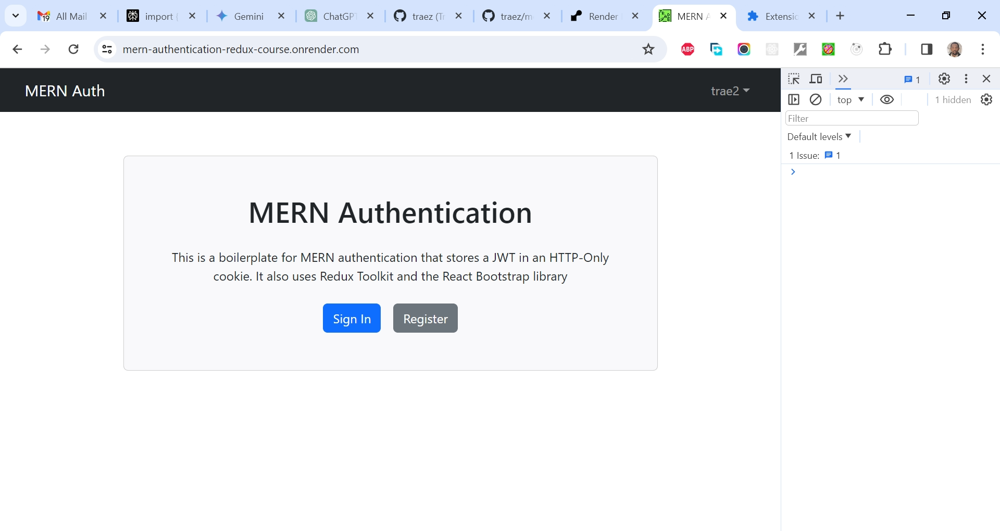

# Pedro Machado's MERN Recipe App with Authentication

This is a solution to the [Pedro Machado's MERN Recipe App with Authentication](https://www.youtube.com/watch?v=P43DW3HUUH8&t=423s). I'm testing my hand creating very simple (follow along) projects for now to get familiar with the matter. 

## Table of contents

- [Overview](#overview)
  - [The challenge](#the-challenge)
  - [Screenshot](#screenshot)
  - [Links](#links)
  - [My process](#my-process)
  - [Built with](#built-with)
  - [What I learned](#what-i-learned)
  - [Continued development](#continued-development)
  - [Useful resources](#useful-resources)
  - [Author](#author)
  - [Acknowledgments](#acknowledgments)

## Overview

### The Challenge/User Stories

Build & Deploy A React Intermediate Project: A MERN Recipe App with Authentication. Learn about Setting up Express.js Server, Setting up MongoDB, Setting Up & Using MongoDB Compass, Creating the Authentication Component, Creating the API for Recipes, creating the UI for Recipes, and Validating Requests.

### Screenshot

### Links

- Solution URL: [https://github.com/traez/mern-recipe-app-with-authentication3](https://github.com/traez/mern-recipe-app-with-authentication3)
- Live Site URL: [https://mern-recipe-app-with-authentication3.onrender.com/](https://mern-recipe-app-with-authentication3.onrender.com/)

## My process

### Built with

- Semantic HTML5 markup 
- CSS custom properties 
- Flexbox 
- CSS Grid 
- Mobile-first workflow 
- [React](https://reactjs.org/) - JS library 
- [Next.js](https://nextjs.org/) - React framework (No)
- Tailwind CSS  
- Typescript (No)
- Nodejs
- Expressjs
- MongoDB

### What I learned

- How to run scripts in two terminals simultaneously (client & server).   
- Understanding the difference between regular dependencies and dev dependencies in package.json files, as it concerns the bundle size of repos.  
- That the Index.js file can be placed in the root or a src folder. Both are acceptable. If the index.js is in src, then you'll need to use the script "node src/index.js" to run it.  
- MongoDB architecture: MongoDB cluster → MongoDB database → Collections → Documents.    
- That the Bcrypt package can automatically generate a random salt, or you can provide a custom salt.  
- About (simultaneous Installation of) npm frontend packages like: axios, react-cookie. And npm backend packages like: nodemon, cors, dotenv, express, jsonwebtoken, mongoose.    
- About the ESLint rule import/first, enforcing that all import statements should be at the top of the file before non-import statements.  
- That when configuring a Create React app to communicate with the backend, you may use the proxy in package.json for relative paths in API calls in the frontend. For Vite however, you'll need to configure the proxy in vite.config.js.  
- That in ECMAScript Modules, you should add ("type": "module") in the package.json file. AAnd aso, include the statement "const __dirname = path.resolve();" after "import path from 'path';" to avoid errors.  
- That when you build your MERN stack React frontend with "npm run build" and serve it as static files from your backend, you should always be sure to remove the "build" keyword from the .gitignore file. This ensures that the build folder gets pushed to GitHub.     

### Continued development

- More MERN (Node.js/Express/MongoDB) project, plus my own signature portfolio MERN project 
- Job serach (Github/LinkedIn/CV/Interviews/TechnicalAssessment)
- Updated CSS features crash course (Kevin Powell)
- React Native/GraphQL
- Next.js Server Actions Apps
- OpenSource (Hackathons)
- Technical Writing

### Useful resources

Stackoverflow  
YouTube  
Google  
ChatGPT

## Author

- Website - [Trae Zeeofor](https://github.com/traez)
- Twitter - [@trae_z](https://twitter.com/trae_z)

## Acknowledgments

- setup-deploy-mern-app-vercel-render [Frontend Vercel, Backend Render]  
- diary-web-app-mern-stack [Frontend Render, Backend Render]  
- full-stack-mern-todo-app [Render (Frontend npm run build React)]  
- dinosaur-generator-app-nodejs [Render (Frontend npm run build Vanilla)]  
- mern-stack-book-store-project-frontend [Frontend Render, Backend Render]  
- mern-recipe-app-with-authentication [Render (Frontend npm run build React)]  